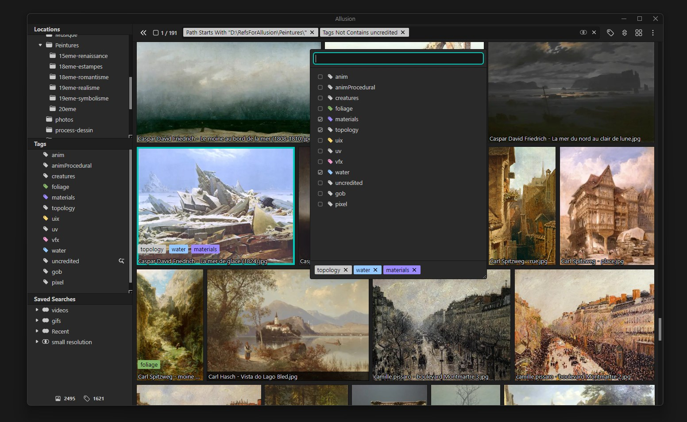

Fork of [Allusion](https://github.com/allusion-app/Allusion/) with:
- Video support.
  - Video and GIF playback options.
- Implied tag relationships.
  - Automatic inheritance of implied tags.
  - Fully compatible with advanced search.
- Extra Properties.
  - Allows you to define extra properties for files.
  - Sort files by their extra property values.
  - Use those extra properties in advanced searches.
- Quality of life improvements.
  - Refresh hotkey.
  - Fixed weird behavior in the tags tree when dragging/dropping or expanding items.
  - Versatile tag selection in the tags tree using and combining modifier keys.
    - Hold Alt to select whole tag collections (a tag and its sub-tags); otherwise, only select visible tags.
    - Hold Command/Control to enable additive/subtractive selection.
    - Hold Shift to enable selecting multiple items in range.
  - Improved thumbnail updates when files change.
  - Retry thumbnail generation when it takes too long.
  - Tag editor can be moved to the side in the main gallery.
  - Find tags using the contextual menu in the tag editor.
  - Adjustable padding for thumbnails in the gallery.
  - Multiple optimizations and bug fixes.
  - And more — see the changelogs in the releases page for more details.
        
Thanks to the developers and the community for your hard work! ❤️

---

Allusion is a tool built for artists, aimed to help you organize your **Visual Library** – A single place that contains your entire collection of references, inspiration and any other kinds of images.

[Read more about Allusion →](https://allusion-app.github.io/)

## Installation

Find the latest version of Allusion on the [Releases](https://github.com/RafaUC/Allusion/releases) page.

## Development

### Quick Start

You need to have [NodeJS](https://nodejs.org/en/download/) and a package manager such as [Yarn](https://yarnpkg.com/lang/en/docs/install/) installed.
Then run the following commands to get started:

1. Run `yarn install` to install or update all necessary dependencies.
2. Run `yarn dev` to build the project files to the `/build` directory. This will keep running to immediately build changed files when they are updated.
3. In a second terminal, run `yarn start` to start the application. Refresh the window (Ctrl/Cmd + R) after modifying a file to load the updated build files.

### Release Build

An installable executable can be built using `yarn package` for your platform in the `/dist` folder. The building is performed using the [electron-builder](https://www.electron.build/) package, and is configured by a section in the `package.json` file.

## Further Information

The original repo had a [wiki] with documentation (https://github.com/allusion-app/Allusion/wiki).
